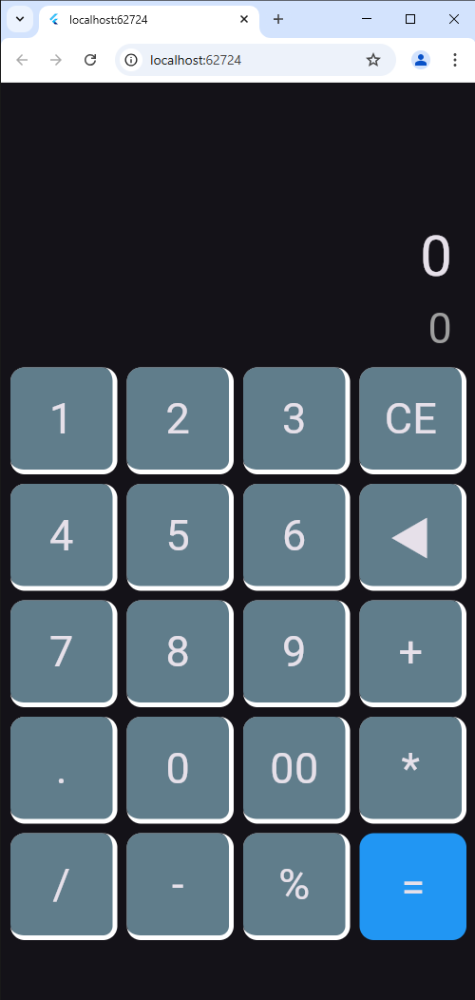
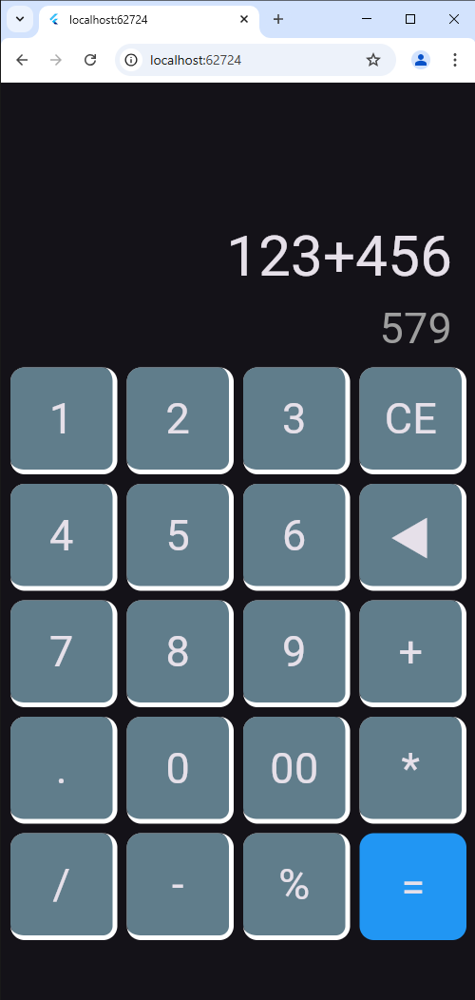
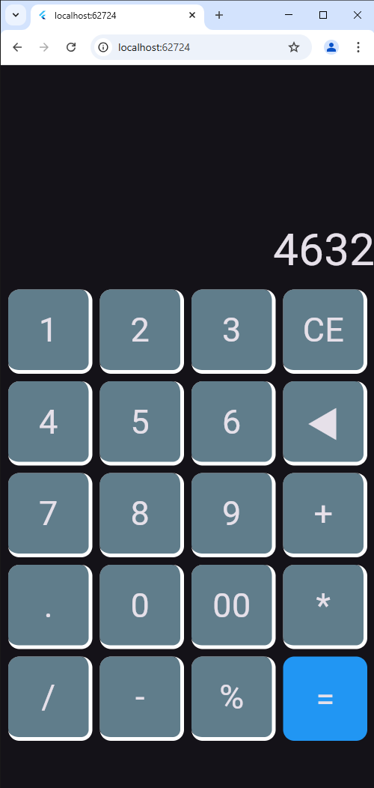

# 📱 Calculator App

A simple and elegant calculator app built using **Flutter**. This app provides basic arithmetic operations with a clean UI.

## 🚀 Features

- 🧮 Basic operations: Addition, Subtraction, Multiplication, Division
- 🎨 User-friendly UI with responsive design
- 📱 Works on both Android & iOS

## 📸 Screenshots

### calculator





## 🛠️ Installation

1. **Clone the repository**:
   ```sh
   git clone https://github.com/sahil-Parmar1/calculator.git
   ```
2. **Install dependencies**:
   ```sh
   flutter pub get
   ```
3. **Run the app**:
   ```sh
   flutter run
   ```
Made with ❤️ using Flutter!